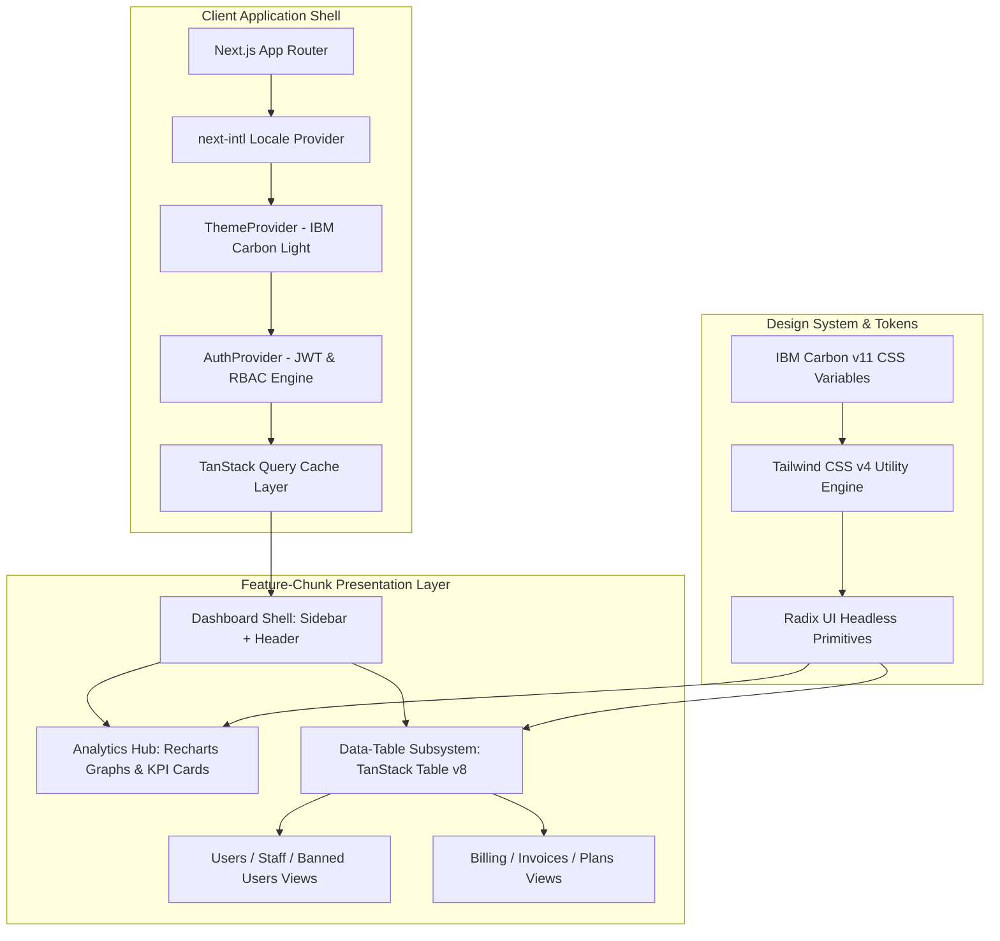

# Nexora SaaS: Frontend & API Architecture Blueprint

This document details the architectural blueprints governing both the **Frontend Presentation Layer** and the **API / Data Access Subsystem** of **Nexora SaaS**.

---

## 1. Frontend Architectural Blueprint

Nexora SaaS uses a multi-tier frontend architecture built on **Next.js 16 (Turbopack), React 19, IBM Carbon Design System v11, shadcn/ui primitives, and Tailwind CSS v4**.



### 1.1 The IBM Carbon Design System Integration
The visual language is rooted in **IBM Carbon Design v11**:
- **Palette Architecture**:
  - **Brand Primary**: Carbon Blue 60 (`#0f62fe`) — used for active tabs, primary buttons, focus indicators, and key metric accents.
  - **Light Mode Canvas**: Carbon Gray 10 (`#f4f4f4`) — provides a calm, glare-free background that reduces eye strain in high-density enterprise environments.
  - **Card Surfaces**: Carbon White (`#ffffff`) with subtle 1px border delineation (`#e0e0e0`).
  - **Dark Mode Surfaces**: Carbon Gray 100 (`#121212` canvas, `#1c1c1c` elevated cards, `#262626` borders).
- **Typography**:
  - Primary font: **IBM Plex Sans** paired with **Inter** for clean readability across data tables and labels.
  - Monospace font: Tabular figures for financial sums, timestamps, and metric counts to prevent layout shifts.
- **Micro-Interactions**:
  - Precision 150ms transitions, subtle scale shifts on buttons, and clear 2px focus rings (`focus-visible:ring-2 focus-visible:ring-primary`).

### 1.2 The Feature-Chunk Component Pattern
To avoid monolithic components that hinder performance and maintainability, every major domain feature is engineered into isolated "chunks":

```text
src/components/shared/users-chunks/
├── users-page.tsx           # Page orchestrator & query binder
├── users-summary-cards.tsx  # 4-metric summary KPI grid
├── users-columns.tsx        # TanStack table column schemas & cell renderers
├── select-user.tsx          # Single user picker dropdown
└── select-users.tsx         # Multi-user bulk selector
```

#### Key Advantages of Chunking:
1. **Isolated Re-renders**: Column definitions remain pure functions (`getUsersColumns(actions, t)`), preventing costly table header and cell re-evaluations during unrelated state updates.
2. **Independent Testing**: Column formatters, action handlers, and KPI calculations can be unit-tested without rendering the entire page tree.
3. **Reusability**: Sub-components like `select-user.tsx` are readily consumed by billing and project creation dialogs.

### 1.3 State Management Topology
Nexora SaaS distinguishes between four types of state:

| State Type | Solution | Scope |
| :--- | :--- | :--- |
| **Server State (Remote Cache)** | TanStack React Query v5 | User records, invoices, analytics data, plans |
| **Global Session State** | React Context (`AuthProvider`) | User profile, JWT token, permissions, auth status |
| **Global Theme State** | `next-themes` (`ThemeProvider`)| Light / Dark mode, system preference sync |
| **URL Search State** | `nuqs` (URL Query State) | Table pagination (`page`), sorting (`sort`), active filters |
| **Local Ephemeral State** | React `useState` / `useReducer` | Dialog open/close, dropdown toggles, active tabs |

---

## 2. API & Data Access Architecture

Nexora SaaS employs a headless, microservice-ready data architecture designed for enterprise reliability.

```mermaid
flowchart LR
    subgraph Browser Frontend
        UI[UI Component] --> API[src/lib/api/*]
        API --> Client[apiClient Axios Singleton]
    end

    subgraph Next.js Edge Server
        Client --> Proxy[/api/[...catchall] Proxy Route]
    end

    subgraph Backend Services
        Proxy --> Microservice[External Microservice Backend: Port 40001]
    end

    subgraph Resilient Fallback Engine
        Client -.->|On Network Failure or 404/5xx| Demo[src/lib/demo-data/ In-Memory Store]
        Demo --> Paginate[paginateDemoList Arithmetic]
        Paginate -.->|Return Normalized Contract| API
    end
```

### 2.1 The Resilient Dual-Mode API Pattern
One of the key engineering achievements in Nexora SaaS is the **Dual-Mode API Layer**:

1. **Production Mode (Live Microservices)**:
   - When configured with `NEXT_PUBLIC_API_URL` or `API_BACKEND_URL`, requests route through the Next.js server proxy (`/api/[...catchall]`) to external Node.js, Go, or Python backends.
   - All authorization tokens are transmitted securely via HTTP headers.
2. **Resilience & Demo Mode (Offline / Showcase)**:
   - If the external backend is offline, unreachable, or returns a 5xx error, the client API wrapper silently intercepts the failure.
   - Instead of breaking the UI with error screens, it queries the in-memory engine in `src/lib/demo-data/index.ts`.
   - The demo engine replicates full backend functionality: in-memory search, status filtering, multi-column sorting, and pagination metadata.
   - This ensures continuous uptime for design reviews, stakeholder presentations, and developer onboarding.

### 2.2 Central Axios Client (`src/lib/myapi/client.ts`)
The API subsystem utilizes a centralized Axios singleton configured for secure HttpOnly cookie session management:

```typescript
export const apiClient = axios.create({
  baseURL: process.env.NEXT_PUBLIC_API_URL || "http://localhost:40001/api",
  headers: {
    "Content-Type": "application/json",
  },
  withCredentials: true, // Forwards HttpOnly session cookies automatically
});

// Response Interceptors:
// 1. Plan gate handler: Dispatches UPGRADE_REQUIRED_EVENT on 403 upgrade_required
// 2. Token refresh handler: Transparently queues failed 401s and attempts session refresh via /auth/refresh
apiClient.interceptors.response.use(
  (response) => response,
  async (error) => {
    // Transparent token refresh on 401 and custom billing event on 403
    ...
  }
);
```

### 2.3 Next.js Catch-All Proxy (`/api/[...catchall]`)
The server proxy route (`src/app/api/[...catchall]/route.ts`) provides several enterprise benefits:
- **Topology Masking**: Hides internal microservice hostnames and ports (`http://localhost:40001`) from browser visibility.
- **CORS Elimination**: Requests from the browser originate from the same domain (`/api/*`), eliminating CORS pre-flight latency.
- **Header Sanitization**: Removes dangerous client-supplied headers before proxying to internal network endpoints.

### 2.4 Data Contracts & Type Schema Synchronization
All data moving across the wire is governed by strict TypeScript contracts:

```typescript
// Standard Paginated Response Contract (src/types/tables.ts)
export interface ApiPaginatedResponse<T> {
  data: T[];
  meta: {
    page: number;
    limit: number;
    total: number;
    totalPages: number;
  };
}
```

Every domain entity (`User`, `Invoice`, `Plan`, `Project`) satisfies these standardized contracts, ensuring seamless interchangeability between live backend databases and in-memory demo fixtures.

---

## 3. UI Component Standardization: Radix UI + shadcn vs IBM Carbon

### 3.1 Decision & Strategy
The codebase historically incorporated elements from both the **IBM Carbon Design System** (`@carbon/react`, `@carbon/icons-react`) and **Radix UI / shadcn/ui** primitives (`radix-ui`, `@radix-ui/react-*`, `components/ui/*`). 

Moving forward, the architectural strategy is **standardized on Radix UI + shadcn/ui** as the canonical component model for all user interface development, while keeping `@carbon/icons-react` for iconography and IBM Plex fonts for enterprise typography.

### 3.2 Comparison & Rationale

| Criterion | Radix UI + shadcn/ui (Chosen Standard) | IBM Carbon React (`@carbon/react`) |
| :--- | :--- | :--- |
| **Styling Paradigm** | Headless primitives styled with Tailwind CSS v4 and CSS variables | Opinionated SCSS sheets with complex BEM classes |
| **Bundle Footprint** | Zero-runtime CSS, component-level tree-shaking, minimal impact | Monolithic SCSS bundle, heavy runtime overhead |
| **React 19 & Next.js 16** | Native support for React Server Components and React 19 hooks | Legacy component wrappers with occasional hydration frictions |
| **Customizability** | Direct source ownership in `src/components/ui/*` | Difficult overrides requiring deep CSS specificity hacks |
| **Accessibility (a11y)** | Built-in WAI-ARIA compliant keyboard navigation and focus trapping | Accessible, but rigid DOM structures |

### 3.3 Implementation & Migration Plan
1. **New Features**: All new UI components, modals, inputs, and flyouts must be authored using Radix UI primitives and shadcn patterns located in `src/components/ui/`.
2. **Iconography**: `@carbon/icons-react` remains the active iconography library via `src/components/ui/carbon/icons.tsx` to maintain visual consistency.
3. **No Immediate High-Risk Rewrite**: Existing `@carbon/react` usages (e.g. notifications, grids in `src/components/ui/carbon/`) remain in place for backward compatibility and will be incrementally refactored to shadcn equivalents during scheduled maintenance cycles.

