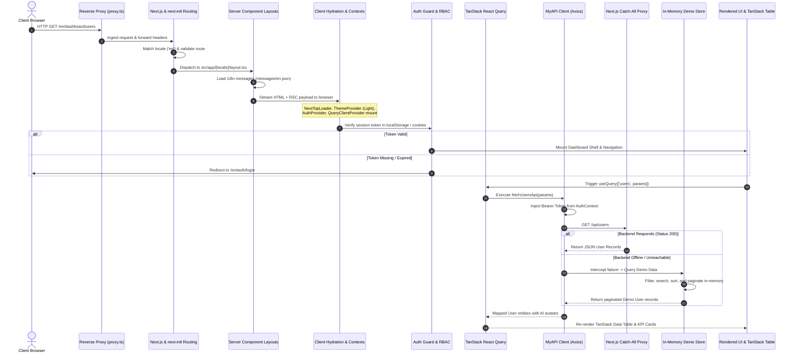
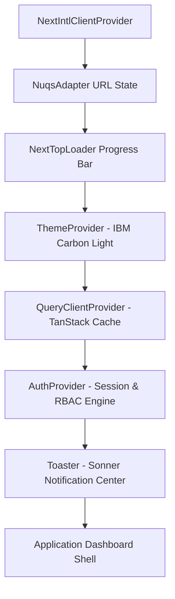
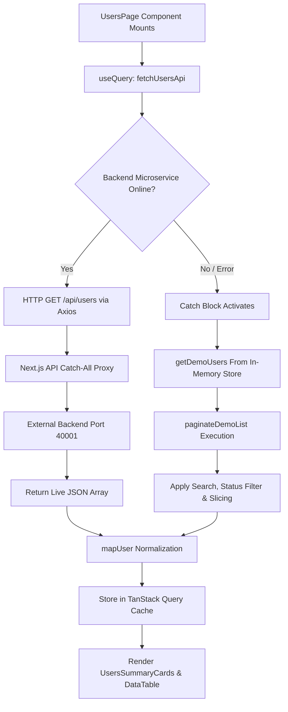
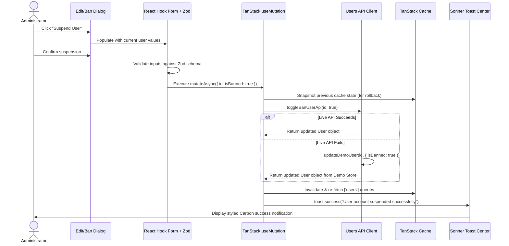

# Nexora SaaS: End-to-End Workflow Architecture
## From Network Entry Point to Client-Side Interactive Rendering

This document details the complete end-to-end operational lifecycle of **Nexora SaaS**. It traces every request from the instant an incoming HTTP request hits the network boundary down to server-side layout resolution, client-side hydration, state initialization, API interceptors, resilient demo data fallback, and reactive DOM rendering.

---

## 1. High-Level Architectural Flowchart



---

## 2. Stage 1: Network Ingress & Edge Proxying

When a user navigates to `https://app.nexora.io/en/dashboard/users` or `http://localhost:3000/en/dashboard/users`:

### 1. Reverse Proxy Layer (`src/proxy.ts`)
- In production environments, reverse proxies (or Dockerized edge gateways) handle TLS termination and pass standard forwarded headers:
  - `X-Forwarded-For`: Client IP address for geolocation and security rate-limiting.
  - `X-Forwarded-Proto`: Enforces HTTPS redirection.
  - `Host`: Used for multi-tenant domain resolution.

### 2. Internationalization Routing (`src/i18n/request.ts` & `next-intl`)
- Nexora SaaS implements path-based multi-language routing using `[locale]`.
- Supported locales: `en` (English), `ar` (Arabic), `de` (German), `es` (Spanish), `fr` (French), `hi` (Hindi), `ru` (Russian), `ur` (Urdu), `zh` (Chinese).
- The routing engine checks the URL prefix:
  - If no locale prefix is present (e.g. `/dashboard/users`), it inspects the `Accept-Language` header and redirects to the preferred supported locale (defaulting to `/en/dashboard/users`).
  - For RTL languages (Arabic and Urdu), the root layout dynamically injects `dir="rtl"` into the HTML tag.

---

## 3. Stage 2: Server-Side Execution & Layout Tree

Next.js 16 executes React Server Components (RSC) on the Node.js server before sending bytes to the client:

```text
src/app/layout.tsx (Global HTML shell)
 └── src/app/[locale]/layout.tsx (Locale-aware layout with i18n & Context Providers)
      └── src/app/[locale]/dashboard/layout.tsx (Dashboard Shell: Sidebar + Header)
           └── src/app/[locale]/dashboard/users/page.tsx (Users Page View)
```

### 1. `src/app/layout.tsx`
- Injects font families: IBM Plex Sans and Inter.
- Defines standard meta tags, viewport settings, and favicon links.

### 2. `src/app/[locale]/layout.tsx`
- Executes `getRequestConfig` asynchronously to load the translation bundle corresponding to the active locale (e.g. `src/messages/en.json`).
- Wraps the application in `NextIntlClientProvider` to make translations accessible to client components via the `useTranslations()` hook.
- Sets up client-side provider hierarchy.

---

## 4. Stage 3: Client-Side Hydration & Context Orchestration

Once the server-rendered HTML arrives at the browser, React 19 hydrates the DOM tree. The following client context providers initialize sequentially:



### 1. `ThemeProvider` (`src/contexts/theme-provider.tsx`)
- Configured with `defaultTheme="light"` and `attribute="class"`.
- Applies the `.light` or `.dark` class to the `<html>` root element.
- Injects IBM Carbon design tokens (`--background: #f4f4f4`, `--card: #ffffff`, `--primary: #0f62fe`).

### 2. `AuthProvider` (`src/contexts/auth-provider.tsx`)
- **Initialization Lifecycle**:
  1. Inspects `localStorage.getItem("token")` and `localStorage.getItem("user")`.
  2. If a cached token exists, it sets the initial state: `user`, `token`, `isAuthenticated: true`.
  3. Dispatches a background validation call `getMeApi()` via `apiClient`.
  4. If the call succeeds, it refreshes user profile details (avatar, role, permissions).
  5. If the call fails (e.g., token expired or revoked), it triggers `logout()`, purges tokens, and redirects the user to `/en/auth/login`.
- **Demo Seed Fallback**: If running without a live backend, it automatically seeds the active session with `DEMO_ADMIN_USER` (`alex.morgan@company.io`) with an AI-generated portrait headshot.

### 3. `QueryClientProvider` (`@tanstack/react-query`)
- Initializes the client-side server state cache.
- Default configuration:
  - `staleTime: 60 * 1000` (1 minute freshness guarantee).
  - `refetchOnWindowFocus: false` (avoids unnecessary re-fetching).
  - `retry: 1` (graceful recovery before fallback).

---

## 5. Stage 4: Layout Shell, Navigation & Route Gatekeeping

Once authentication is validated, the dashboard shell mounts:

### 1. `DashboardSidebar` (`src/components/shared/sidebar-chunks/dashboard-sidebar.tsx`)
- Displays the **Nexora SaaS** brand with the modern geometric logo emblem.
- Collapsible navigation groups organized by domain:
  - **Dashboard**: Analytics Overview (`/en/dashboard/overview`).
  - **Users**: Users (`/en/dashboard/users`), Staff (`/en/dashboard/staffs`), Banned Users (`/en/dashboard/banned-users`).
  - **Billing**: Plans, Subscriptions, Transactions, Invoices.
  - **Management**: Projects, Files.
- Renders the bottom `NavUser` profile card featuring the logged-in user's photo headshot (`/avatars/alex-morgan.jpg`), user status badge, and an account management popover menu.

### 2. `DashboardHeader` (`src/components/shared/header-chunks/dashboard-header.tsx`)
- Contains the dynamic breadcrumb trail (e.g., `Platform / Users`).
- Sidebar trigger toggle (mobile sheet and desktop collapsed state).
- Language selector dropdown (switches `[locale]` with zero page reload).
- Carbon theme toggler button (seamlessly transitions between Carbon Light and Dark mode).

### 3. Route Guard Enforcement
- Protected routes under `/dashboard/*` verify `isAuthenticated`. If false and `isLoading` finishes, `useRouter().replace("/en/auth/login")` fires automatically.
- A client-side lock screen dialog activates upon idle timeout or manual user lock, preserving open forms without discarding draft inputs.

---

## 6. Stage 5: Client Data Fetching & Dual-Mode Resiliency

When the user enters a page like `/en/dashboard/users`:



### 1. API Call Trigger
The client component invokes domain-specific API methods, for example:
```typescript
const { data, isLoading } = useQuery({
  queryKey: ["users", tableParams],
  queryFn: () => fetchUsersApi(tableParams),
});
```

### 2. Request Interceptor (`src/lib/myapi/client.ts`)
- Axios intercepts the outgoing request.
- Automatically injects the Authorization header:
  ```http
  Authorization: Bearer <jwt_token>
  ```
- Normalizes query parameters (e.g., `page`, `limit`, `search`, `status`).

### 3. The Dual-Mode Resilient Fallback Pattern
Nexora SaaS implements high-availability resiliency:
1. **Primary Route**: Tries to connect to `apiClient.get("/users")`.
2. **Next.js Proxy Handler** (`src/app/api/[...catchall]/route.ts`):
   - Forwards request to `process.env.API_BACKEND_URL || "http://localhost:40001"`.
   - Strips dangerous headers and handles CORS.
3. **Graceful Fallback**:
   - If the microservice backend is offline, unreachable, or returns a 5xx/404 error, the `try/catch` block intercepts the failure silently.
   - It seamlessly queries `src/lib/demo-data/index.ts`.
   - Executes `paginateDemoList()` to filter by name/email, apply status chips (Active, Banned, Inactive), sort columns, and return a pagination payload matching the production API response contract:
     ```typescript
     {
       data: User[],
       meta: {
         page: 1,
         limit: 10,
         total: 8,
         totalPages: 1
       }
     }
     ```
4. **Avatar Propagation**:
   - `mapUser()` attaches real portrait photo URLs (e.g., `/avatars/sarah-chen.jpg`) to user entities.
   - `SpaceAvatar` receives the URL and renders the high-definition image with initials fallback.

---

## 7. Stage 6: Client Mutation Flow & Optimistic Updates

When an administrator performs an action (e.g. banning a user, editing an invoice, or updating permissions):



---

## 8. Summary Table of Component Interactions

| Layer | Primary Files | Main Responsibility |
| :--- | :--- | :--- |
| **Network & Ingress** | [`proxy.ts`](file:///Users/mac/Documents/nextjs-fullstack-saas-starter/src/proxy.ts), Next.js Middleware | Reverse proxy headers, TLS termination, locale routing |
| **Server Shell** | `src/app/[locale]/layout.tsx`, `layout.tsx` | Translation loading, HTML `dir` attribute injection, metadata |
| **Client Contexts** | [`theme-provider.tsx`](file:///Users/mac/Documents/nextjs-fullstack-saas-starter/src/contexts/theme-provider.tsx), [`auth-provider.tsx`](file:///Users/mac/Documents/nextjs-fullstack-saas-starter/src/contexts/auth-provider.tsx) | Theme tokens, session state, JWT storage, route protection |
| **Data Fetching** | [`client.ts`](file:///Users/mac/Documents/nextjs-fullstack-saas-starter/src/lib/myapi/client.ts), `src/lib/api/*` | Token injection, error handling, live API calls |
| **Resilience Engine** | [`index.ts`](file:///Users/mac/Documents/nextjs-fullstack-saas-starter/src/lib/demo-data/index.ts) | In-memory filtering, pagination, search, seeder records |
| **Presentation** | `src/components/shared/*-chunks/` | Metric summary cards, TanStack tables, Recharts visualizations |
