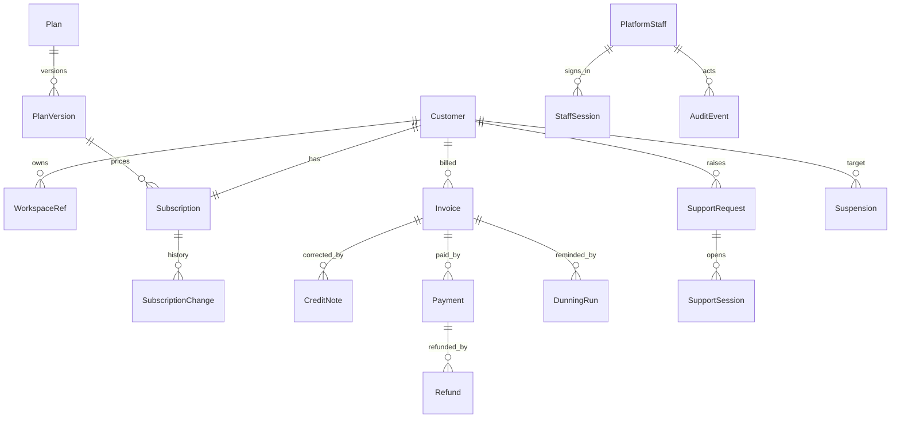
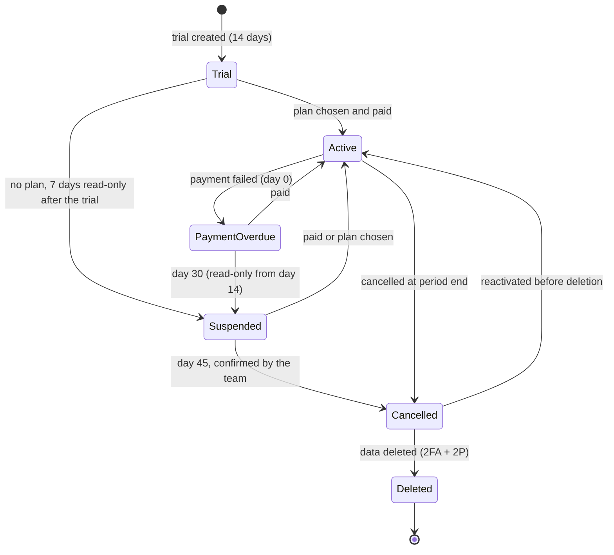
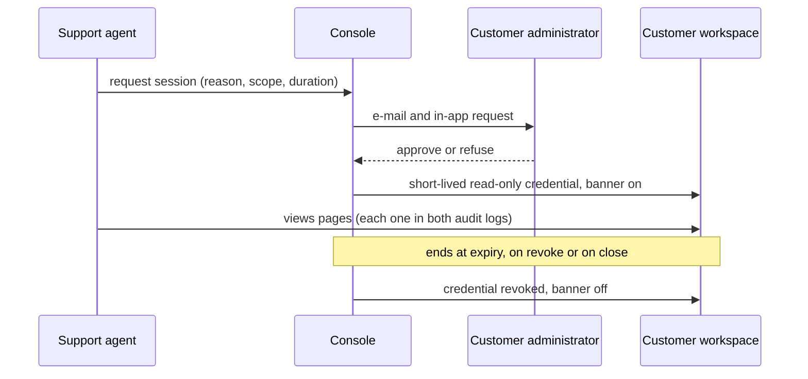
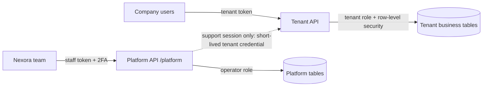

# Nexora — Cahier des charges
## Platform Console: administration of Nexora by the Nexora team

*Functional, technical and delivery specification*

| | |
|---|---|
| **Version** | 1.1 |
| **Reference date** | 7 October 2026 |
| **Status** | Decisions closed (Step 0); ready for delivery of Lot A |
| **Scope** | Nexora admin console and the services behind it |
| **Classification** | Confidential |
| **Audience** | Nexora team: owner, support, finance, engineering |

> No customer data by default • Every action audited • Billing that reconciles

---

## 1. Executive Summary

Nexora is sold as a subscription to services companies. Two products therefore live under the same name: the ERP each customer company uses to run its own business, and the console the Nexora team uses to run Nexora as a business. This specification covers the second one, the **platform console**: how the Nexora team manages customers, plans, subscriptions, its own invoices and payments, support, platform health and the audit trail, without ever reaching into a customer's business data by default.

**The problem.** The console started from a generic subscription template. Its pages have been grouped into one "Nexora admin" menu, hidden from customer companies, and rebuilt on Nexora's own customers and prices. What remains is to turn a demonstration console into an operating tool: authority enforced by the server, a separate operator role with no access to tenant business data, billing that follows Moroccan rules and reconciles with the bank, a controlled way to help a customer, and a complete audit trail.

**The product.** One console where a member of the Nexora team can answer, in under a minute, the questions that run a subscription business: who are our customers and what do they pay, who is late, who is about to churn, what failed last night, and who did what in the console.

**Users.** The Nexora team only: the owner, support agents, the finance officer and the engineer on call. Customer companies never see the console and cannot reach it.

**Positioning.** The console follows the practice of mature subscription platforms: operators manage accounts and billing, not customer content. Access to a customer's workspace is requested, approved, time-limited and recorded.

### 1.1 Current State

The console exists as a front-end with demonstration data. It provides:

- a "Nexora admin" menu shown only to the Nexora team and blocked for company users when a page is opened directly;
- a Customers page listing the companies using Nexora with plan, status (trial, active, payment overdue, cancelled), people against the plan limit, monthly recurring revenue, customer-since date, and MRR and ARR cards;
- a Plans page with three plans in Moroccan dirhams before VAT: Starter 490 MAD for 5 people, Business 1,490 MAD for 25 people, Enterprise 3,990 MAD with no limit, yearly billing charged as ten months;
- Subscriptions, Invoices, Transactions and Taxes pages built on Nexora's customers, invoices in MAD with 20% Moroccan VAT, and a failed card payment and a refund in the demonstration data;
- Users, Staff, Banned users, Reports, System issues, Roles and Sessions pages inherited from the template.

Authority checks are performed in the interface today. The server-side operator role, the support-access workflow, real payment collection, Nexora's own e-invoicing and the console audit trail do not exist yet.

### 1.2 Design Principles

When two requirements conflict, the earlier principle wins.

1. **Customer data stays the customer's.** Operators see account and billing information, never a tenant's employees, clients, projects, timesheets or invoices, unless the customer has approved a time-limited support session.
1. **The server decides.** Every console permission is enforced by the API under a separate operator role; hiding a menu is never the protection.
1. **Everything is recorded.** Every console action that changes money, access, status or configuration writes an immutable audit event with who, when, what, before and after.
1. **Billing reconciles.** Every invoice has a sequential number, every payment matches an invoice or is explained, and the MRR shown equals the sum of active subscriptions.
1. **Least privilege.** Each team member has the narrowest role that lets them work; sensitive actions require a second factor and, for some, a second person.
1. **Same quality as the product.** The console meets the accessibility and speed standards of the ERP (Section 14).

### 1.3 How to Read This Document

Requirements are prioritized with the MoSCoW method: **M** (Must, needed before the first paying customer is managed in the console), **S** (Should), **C** (Could) and **W** (Won't in this scope). Each carries a stable identifier made of a module prefix and a number.

**Table 1: Requirement identifier prefixes.**

| **Prefix** | **Module** | **Prefix** | **Module** |
|---|---|---|---|
| CUS | Customers and tenant lifecycle | STF | Nexora staff, roles and sessions |
| PLA | Plans and pricing | SUP | Support access and requests |
| SUB | Subscriptions and seats | INC | Platform health and incidents |
| INV | Nexora's invoices to customers | AUD | Audit trail and data requests |
| PAY | Payments, transactions, dunning | MET | Metrics and reports |
| TAX | Taxes | CFG | Console configuration |
| USR | Platform user directory | A11Y, PERF | Accessibility and speed follow-up |
| BR | Business rules | SEC, NFR | Security, non-functional |

## 2. Objectives and Scope

The console exists to let a small team run Nexora safely: collect what customers owe, help them without overstepping, see problems before customers do, and prove afterwards what was done. Each objective below has a measure that will show, three months after the first paying customer, whether it was met.

### 2.1 Objective Register

**Table 2: Objective register with measures.**

| **ID** | **Objective** | **Measure** |
|---|---|---|
| OBJ-1 | Every paying customer is invoiced correctly and on time | 100% of renewals invoiced on the renewal date; zero numbering gaps |
| OBJ-2 | Overdue payments are recovered quickly | Median days from failed payment to recovery under 7 |
| OBJ-3 | No operator reaches customer business data without approval | Zero tenant-data reads outside an approved support session |
| OBJ-4 | Every console action is traceable | 100% of state-changing actions have an audit event |
| OBJ-5 | The team sees revenue and churn without spreadsheets | MRR, ARR and churn read from the console and reconcile with invoices |
| OBJ-6 | Incidents are detected before customers report them | Share of incidents opened by monitoring rather than by a customer |
| OBJ-7 | The console is usable by every team member | WCAG 2.2 AA on every console page; no critical accessibility finding |

### 2.2 In Scope

- The thirteen console pages and their server side: Customers, Users, Staff, Account suspension (today "Banned users"), Plans, Subscriptions, Invoices, Transactions, Taxes, Reports, System issues, Roles and Sessions.
- New capabilities: customer lifecycle, dunning, Nexora's own e-invoices, support access sessions, support requests, platform health, console audit trail, metrics and data requests (export and deletion).
- The operator role and its separation from tenant data.
- The follow-up of release 6h.5 (Section 14).

### 2.3 Out of Scope

- The customer ERP itself, specified in the Nexora ERP cahier des charges.
- A public marketing site and self-service sign-up flow, except the trial creation the console must support.
- Content moderation: Nexora is a business tool without public content, so the template's content reports are retired (CUS and USR requirements).
- Impersonation of customer users: support works through approved, read-only sessions, never by signing in as a user.

### 2.4 Assumptions

1. Nexora is operated by a Moroccan company (Nexora SARL) invoicing in MAD with Moroccan VAT, as in the current demonstration data.
1. The ERP's multi-tenant model holds: every tenant record carries a workspace identifier, enforced by the API and the database.
1. Payments are collected by bank transfer and by card through a payment provider to be chosen (decision D-01).
1. The team is small (two to six people) during the first year, so approval flows must not need more than two people.

### 2.5 Success Criteria

The console is ready when the reference scenario of Section 13.2 runs end to end with the expected amounts, the cross-tenant and operator-separation test suites pass, every console action in that scenario appears in the audit trail, and an external reviewer confirms that an operator without an approved session cannot read any tenant business record.

## 3. Users and Roles

The console has seven roles (Table 4), all held by members of the Nexora team. They differ by what they may change, not by what they may read about customers' business, which is nothing by default. A sixth actor, the customer's own administrator, appears in the console only as the person who approves support sessions and receives billing notices.

### 3.1 Personas

**Table 3: Console personas.**

| **Persona** | **Daily work** | **What the console must give them** |
|---|---|---|
| Owner (founder) | Pricing, revenue, approvals of sensitive actions | MRR, ARR, churn and overdue at a glance; approval queue |
| Support agent | Answering customers, diagnosing issues | Customer account view, support requests, support sessions with approval |
| Finance officer | Invoices, payments, refunds, VAT | Invoice and payment ledger, reconciliation, VAT summary, exports for the accountant |
| Engineer on call | Incidents, platform health | Health checks, incident log, error rates per tenant without business data |
| Sales and demos | Trials and demonstrations | Trial creation, demo workspaces, conversion status |
| Customer administrator | External: approves support sessions, pays | Clear notices, approval links, invoices in My subscription |

### 3.2 Console Roles

**Table 4: Console roles.**

| **Role** | **Purpose** | **Typical holder** |
|---|---|---|
| Platform owner | Every console permission, including roles, prices and refunds above the limit | Founder |
| Platform admin | Customers, subscriptions, staff (except owners), configuration | Operations lead |
| Support | Customer account view, support requests, support sessions | Support agents |
| Finance | Invoices, payments, refunds within the limit, taxes, exports | Finance officer |
| Engineering | Health, incidents, sessions, technical logs | Engineer on call |
| Sales | Trials, demo workspaces, conversion follow-up; customers in read mode | Sales and demos |
| Read-only | Every console page in read mode | Advisors, auditors |

### 3.3 Role Principles

1. A team member has one console role; a change of role is an audited action by a platform owner.
1. No console role grants access to tenant business tables. Support sessions are the only path, and they are approved by the customer.
1. Sensitive actions (refunds above the limit, price changes, suspensions, role changes) require a second factor at the moment of the action; refunds above the limit and account deletions also require a second team member's approval.
1. Shared accounts are forbidden; every action is attributable to one person.
1. A team member who leaves loses access the same day; their sessions are revoked and their open approvals reassigned.

## 4. Existing Console and Gap Analysis

The console's pages exist and show realistic demonstration data; what is missing is mostly behind them: server-side authority, persistence, money movement, and the controls that make operating on real customers safe. Table 5 records, page by page, what exists and the decision: *keep*, *transform*, *new* or *retire*.

### 4.1 Page-by-Page Decision

**Table 5: Gap analysis per console page.**

| **Page** | **Today** | **Required** | **Decision** |
|---|---|---|---|
| Customers | List with plan, status, seats, MRR, since; MRR and ARR cards; open a demo workspace | Lifecycle actions, account view, notes, health, data requests | Transform |
| Users | People of customer companies with their company | Directory limited to account fields; lock and unlock; no business data | Transform |
| Staff | Nexora team and company admins | Nexora team only, with console roles and two-factor status | Transform |
| Banned users | Blocked accounts | Account suspension with reason, scope (user or company) and expiry | Transform |
| Plans | Three plans in MAD with features and counts | Versioned prices, change scheduling, grandfathering | Transform |
| Subscriptions | Each company's subscription | Upgrades, downgrades, seats, renewals, cancellation, proration | Transform |
| Invoices | Nexora's invoices in MAD with 20% VAT | Sequential numbering, credit notes, e-invoice file, PDF, delivery | Transform |
| Transactions | Payments, a failed card payment, a refund | Collection, reconciliation, retries, refunds with approval | Transform |
| Taxes | Moroccan VAT rates | VAT rules per customer country, VAT summary per period | Transform |
| Reports | Content reports from the template | Retired; replaced by Metrics and reports | Retire |
| System issues | Issue list | Health checks, incidents, status communication | Transform |
| Roles | Role and permission editor | Console roles of Table 4 | Transform |
| Sessions | Session list | Team sessions with revocation; idle timeout | Keep and extend |
| Support | No page | Support requests and support sessions | New |
| Audit trail | ERP audit log only | Console audit trail, immutable, exportable | New |
| Metrics | Cards on Customers | MRR, ARR, churn, cohorts, overdue, trial conversion | New |

### 4.2 Prerequisites

**Table 6: Prerequisites before the console manages real customers.**

| **Item** | **Why it matters** | **Action** |
|---|---|---|
| Server-side operator role | Interface checks can be bypassed | Separate API surface and database role for operators |
| Persistent platform data | Demo data cannot bill anyone | Platform tables (Section 7) |
| Payment provider | No real collection today | Choose and integrate (D-01) |
| Console audit trail | Actions on money and access must be provable | Immutable event store from the first release |
| Two-factor for operators | Console accounts are the most valuable to attackers | Mandatory TOTP before first sign-in |
| Retirement of content reports | Consumer feature with no use in an ERP | Remove page, data and menu entry |

## 5. Functional Requirements

This section specifies 106 requirements in thirteen modules. Each module opens with its purpose; the table is the contract. Acceptance criteria are tests a reviewer can run on staging with the demonstration customers and a console account of each role.

### 5.1 Customers and Tenant Lifecycle

A customer is a company with one or more workspaces and one subscription. The Customers module is where the team sees every customer's account, plan, status and health, and moves a customer through its lifecycle: trial, active, payment overdue, suspended, cancelled, deleted. It never shows the customer's business records.

**Table 7: Customer and lifecycle requirements.**

| ID | Requirement | Priority | Acceptance criterion |
|---|---|---|---|
| CUS-01 | The Customers list shows name, city, country, plan, billing period, status, people used against the plan limit, MRR and customer-since date | M | Values match the subscription and invoice records |
| CUS-02 | Filters by plan, status, country and billing period; search by name, ICE or administrator e-mail | M | Combined filters return the expected customers |
| CUS-03 | Summary cards: MRR and ARR before VAT, paying customers, trials, people using Nexora, overdue amount | M | Cards equal the formulas of Section 6 |
| CUS-04 | A customer account page shows identity (legal name, ICE, IF, address), administrator, plan, seats, invoices, payments, support history, notes and audit events | M | No tenant business record appears on the page |
| CUS-05 | An operator (Owner, Admin or Sales) can create a trial for a new company with its administrator's e-mail; the administrator receives an invitation | M | Trial created with end date and invitation sent |
| CUS-06 | A trial ends on its end date; the customer chooses a plan or the workspace becomes read-only | M | Expired trial fixture is read-only |
| CUS-07 | Status changes follow the lifecycle of Figure 2; any other transition is refused | M | Invalid transition returns an error |
| CUS-08 | Suspension records a reason and an expiry, makes the workspace read-only and notifies the customer administrator | M | Suspended fixture is read-only with a banner |
| CUS-09 | Cancellation takes effect at the end of the paid period unless a refund is approved | M | Cancelled fixture keeps access until period end |
| CUS-10 | Internal notes on a customer are visible to the team only and are audited | S | Note appears with author and date |
| CUS-11 | A health indicator combines payment status, seat usage, last sign-in and open support requests | C | Indicator matches its rule on fixtures |
| CUS-12 | Demonstration workspaces are flagged and can be opened by the team; real customer workspaces cannot be opened without a support session | M | "Open workspace" appears only on demo customers |

### 5.2 Plans and Pricing

Plans define what a customer pays and what it gets. Prices change over time; a change must never alter an invoice already issued and must apply to existing customers only on the terms the owner decides.

**Table 8: Plan and pricing requirements.**

| ID | Requirement | Priority | Acceptance criterion |
|---|---|---|---|
| PLA-01 | Three plans: Starter (5 people), Business (25 people), Enterprise (unlimited), monthly price before VAT, yearly billing charged as ten months | M | Plan page shows Table 20 values |
| PLA-02 | Each plan lists its included features; the same list appears in each customer's My subscription page | M | Same text in console and customer page |
| PLA-03 | A price change creates a new plan version with an effective date; earlier versions stay attached to existing subscriptions | M | Existing customer keeps its price after a change |
| PLA-04 | The owner chooses, per price change, whether existing customers move at their next renewal or keep the old price | S | Both options produce the expected renewal amount |
| PLA-05 | Only a platform owner can create or change a plan, with a second factor | M | Other roles see the page read-only |
| PLA-06 | Each plan shows how many customers use it and its MRR | S | Counts equal the subscription records |
| PLA-07 | A plan can be retired for new sales while existing subscriptions continue | S | Retired plan absent from the upgrade list |
| PLA-08 | Discounts are explicit (percentage or amount, duration, reason) and visible on invoices | C | Discount line appears with its reason |

### 5.3 Subscriptions and Seats

A subscription ties a customer to a plan version, a billing period and a number of people. Seats are counted from active and invited accounts, as in the customer's Team access page; the console shows the same figure.

**Table 9: Subscription and seat requirements.**

| ID | Requirement | Priority | Acceptance criterion |
|---|---|---|---|
| SUB-01 | Each subscription shows plan, version, billing period, start, next renewal, seats used and included, status and payment method | M | Values match the customer's My subscription page |
| SUB-02 | An upgrade takes effect immediately with a prorated charge for the rest of the period (BR-05) | M | Reference scenario step 4 amount is reproduced |
| SUB-03 | A downgrade takes effect at the next renewal | M | Plan changes on the renewal date only |
| SUB-04 | A downgrade to a plan with fewer seats than the people in place is refused, as in the customer page | M | Refusal with the number of seats to free |
| SUB-05 | A change from monthly to yearly billing starts a new yearly period with credit for the unused monthly days | S | Credit line on the first yearly invoice |
| SUB-06 | Renewal creates the invoice on the renewal date and attempts collection | M | Renewal fixture produces one invoice and one attempt |
| SUB-07 | Cancellation at period end and immediate cancellation with refund are both available; the second needs finance approval | M | Both paths produce the expected status and credit note |
| SUB-08 | Every subscription change is shown in a history with who, when, from and to | M | History lists each change |
| SUB-09 | Seat usage at 100% notifies the customer administrator and shows on the customer page | S | Notice created once per period |
| SUB-10 | Operators can apply a temporary seat or feature extension with an expiry and a reason | C | Extension expires automatically |

### 5.4 Nexora's Invoices

Nexora is a Moroccan company and its invoices to customers follow the same rules the ERP applies to its users' invoices: sequential numbering, identifiers of both parties, VAT by rate, credit notes for corrections and the electronic invoice file required by the tax administration.

**Table 10: Invoice requirements.**

| ID | Requirement | Priority | Acceptance criterion |
|---|---|---|---|
| INV-01 | Invoices are numbered sequentially per year without gaps, at issue | M | Numbering test over a year boundary |
| INV-02 | An invoice shows Nexora's legal identity (name, ICE, IF, RC, Patente, CNSS, address, bank details) and the customer's (name, ICE for Moroccan companies, address) | M | PDF review against the checklist |
| INV-03 | Lines show plan, period, seats, discounts and prorations, with VAT per rate and totals before and after VAT | M | Totals recompute to the cent |
| INV-04 | An issued invoice is never edited or deleted; corrections are made by credit note | M | Edit and delete are refused on issued invoices |
| INV-05 | Invoices are generated as PDF and as the electronic invoice file (UBL 2.1) and sent to the customer administrator | M | Both files produced; e-mail sent |
| INV-06 | E-invoice status per invoice: to send, sent, accepted with reference, rejected with reason | S | Status follows the platform's answer |
| INV-07 | Invoices appear in the customer's My subscription page with download | M | Same invoices in both places |
| INV-08 | Due date follows the payment terms (immediate for card, 15 days for transfer, decision D-04) | M | Due dates on fixtures |
| INV-09 | Finance can export invoices and credit notes for a period to the accountant (CSV, Excel, PDF) | M | Export totals equal the console totals |
| INV-10 | A pro-forma can be produced for customers who pay by transfer before activation | C | Pro-forma has no invoice number |

### 5.5 Payments, Transactions and Dunning

Transactions record every movement of money between customers and Nexora: payments, failures, refunds and chargebacks. Dunning is the schedule that recovers a failed payment before the customer loses access.

**Table 11: Payment and dunning requirements.**

| ID | Requirement | Priority | Acceptance criterion |
|---|---|---|---|
| PAY-01 | Each transaction shows date, customer, invoice, method (card, transfer), amount, status and provider reference | M | List matches provider records |
| PAY-02 | Card payments are collected through the payment provider; card data never reaches Nexora's servers | M | No card number in any Nexora table or log |
| PAY-03 | Bank transfers are matched to invoices by reference and amount; unmatched receipts wait in a queue | M | Matching fixture assigns 3 of 3 transfers |
| PAY-04 | A failed payment starts the dunning schedule of BR-08 and sets the customer to "payment overdue" | M | Status and reminders follow the schedule |
| PAY-05 | Each reminder is recorded on the customer page with its date and channel | M | Reminders listed |
| PAY-06 | A successful payment during dunning stops the schedule and restores "active" | M | Status restored the same day |
| PAY-07 | Refunds create a credit note and a refund transaction; above 1,000 MAD VAT included they need a second team member's approval | M | Approval required above the limit |
| PAY-08 | Chargebacks are recorded with their reason and reopen the invoice | S | Invoice returns to "unpaid" |
| PAY-09 | Daily reconciliation compares invoices, payments and provider settlements and lists differences | S | Report lists zero differences on fixtures |

### 5.6 Taxes

**Table 12: Tax requirements.**

| ID | Requirement | Priority | Acceptance criterion |
|---|---|---|---|
| TAX-01 | VAT rates are configured with effective dates; the standard rate for Nexora's services is 20% | M | Rate change applies from its date only |
| TAX-02 | The VAT treatment of a customer depends on its country and status; non-Moroccan customers follow the rule decided in D-05 | M | Northwind fixture invoiced per D-05 |
| TAX-03 | A VAT summary per month or quarter lists collected VAT on payments received, consistent with the VAT-on-payment regime | S | Summary equals the sum of payments' VAT |
| TAX-04 | Withholding or exemptions are recorded with their legal reference | C | Reference printed on the invoice |

### 5.7 Platform User Directory and Suspension

The Users page lets support find a person and their company. It shows account fields only. The template's "Banned users" becomes account suspension, which applies to one person or to a whole company and always has a reason.

**Table 13: User directory and suspension requirements.**

| ID | Requirement | Priority | Acceptance criterion |
|---|---|---|---|
| USR-01 | The directory shows name, e-mail, company, role in the company, status, two-factor status and last sign-in | M | No business data shown |
| USR-02 | Search by name, e-mail or company | M | Search returns the expected person |
| USR-03 | Support can trigger a password-reset e-mail but never sees or sets a password | M | No password field exists in the console |
| USR-04 | A person can be suspended with a reason and an optional expiry; their sessions are revoked at once | M | Suspended user is signed out within one minute |
| USR-05 | Suspending a company administrator requires that another administrator exists or that the company is suspended too | M | Refusal when the company would have no admin |
| USR-06 | Suspensions and lifts are audited and visible on the person's and the company's page | M | Audit events present |
| USR-07 | The Reports page and its content-report data are removed | M | Route returns not found; menu entry gone |
| USR-08 | Directory exports are limited to platform owners and are audited | S | Export refused for other roles |

### 5.8 Nexora Staff, Roles and Sessions

**Table 14: Staff, role and session requirements.**

| ID | Requirement | Priority | Acceptance criterion |
|---|---|---|---|
| STF-01 | The Staff page lists Nexora team members only, with console role, two-factor status and last sign-in | M | Company administrators no longer appear |
| STF-02 | Inviting a team member requires a platform owner; the invitation expires after 72 hours | M | Expired invitation refused |
| STF-03 | Two-factor authentication is set up before the first console page opens | M | Account without two-factor sees only the set-up page |
| STF-04 | Console roles follow Table 23; custom roles are not allowed in the first release | M | Role editor offers the seven roles only |
| STF-05 | The Sessions page shows each team session (device, location, start, last activity) with revocation | M | Revoked session ends at once |
| STF-06 | Console sessions expire after 30 minutes of inactivity and 12 hours in total | M | Session timeout test |
| STF-07 | Removing a team member revokes sessions, pending approvals and support sessions the same day | M | Off-boarding test |
| STF-08 | An optional IP allow-list restricts console access | C | Request from outside the list refused |

### 5.9 Support Access and Requests

Support needs to see what the customer sees, without reading what the customer has not chosen to share. A support session is requested by an agent, approved by the customer administrator, limited in time and scope, visible to the customer while it lasts, and fully recorded.

**Table 15: Support requirements.**

| ID | Requirement | Priority | Acceptance criterion |
|---|---|---|---|
| SUP-01 | Customers raise support requests from inside Nexora; each has a category, priority, status and conversation | M | Request appears in the console queue |
| SUP-02 | The queue shows open requests by priority and age, with assignment to an agent | M | Assignment recorded |
| SUP-03 | An agent requests a support session with reason, scope (read-only by default) and duration (default 60 minutes, maximum 24 hours) | M | Request reaches the customer administrator |
| SUP-04 | The customer administrator approves or refuses; without approval no session opens | M | Unapproved request cannot be used |
| SUP-05 | During a session a banner tells the customer's users that Nexora support has access, and until when | M | Banner visible on every page |
| SUP-06 | Sessions end at their expiry, when the customer revokes them, or when the agent closes them | M | Each ending path tested |
| SUP-07 | Every page the agent opens and every action during a session is written to both the console audit trail and the customer's audit log | M | Events appear in both logs |
| SUP-08 | A write-scoped session (to fix data on request) needs the customer's explicit approval of write scope and the owner's second approval | S | Write session refused without both |
| SUP-09 | An emergency session for a security incident requires two team members and is reported to the customer afterwards | C | Report sent within 24 hours |
| SUP-10 | Response-time targets per priority are shown and breaches highlighted | S | Breach flag on overdue requests |

### 5.10 Platform Health and Incidents

**Table 16: Health and incident requirements.**

| ID | Requirement | Priority | Acceptance criterion |
|---|---|---|---|
| INC-01 | A health page shows the state of the API, database, background jobs, file storage, e-mail and payment provider | M | Simulated outage turns its tile red |
| INC-02 | Error rates and response times are shown per service and per tenant, without tenant business data | S | Tenant shown by name and identifier only |
| INC-03 | An incident has a severity, start, affected services and customers, timeline, resolution and post-mortem | M | Incident record complete on close |
| INC-04 | Customers affected by an incident receive a notice, and a status message appears in their Nexora | S | Notice and banner on affected tenants |
| INC-05 | System issues detected by monitoring open an incident draft automatically | S | Health check failure creates a draft |
| INC-06 | Backups and restore tests are listed with date and result | M | Last restore test visible |
| INC-07 | Scheduled maintenance is announced to customers at least 48 hours ahead | S | Announcement created with lead time |

### 5.11 Audit Trail and Data Requests

**Table 17: Audit and data request requirements.**

| ID | Requirement | Priority | Acceptance criterion |
|---|---|---|---|
| AUD-01 | Every state-changing console action writes an event with actor, role, action, target, before, after, time, IP and session | M | Event present for each action of the reference scenario |
| AUD-02 | Events are append-only; no role can edit or delete them | M | Update and delete refused at database level |
| AUD-03 | The audit trail can be filtered by actor, customer, action and period, and exported by platform owners | M | Export equals the filtered list |
| AUD-04 | Customer data-export requests are recorded, fulfilled with the tenant export within 7 days and logged | M | Request lifecycle complete |
| AUD-05 | Account-deletion requests delete the tenant's data after the retention period required for invoices, with two-person approval | M | Deletion leaves only invoice records required by law |
| AUD-06 | Audit events are kept for at least 5 years | S | Retention policy configured |
| AUD-07 | Sensitive reads (directory export, audit export) are themselves audited | M | Export creates an event |

### 5.12 Metrics and Reports

**Table 18: Metrics and report requirements.**

| ID | Requirement | Priority | Acceptance criterion |
|---|---|---|---|
| MET-01 | MRR, ARR, paying customers, average revenue per customer and seat usage, with month-over-month change | M | Values equal BR formulas on fixtures |
| MET-02 | MRR movement: new, expansion, contraction, churn and reactivation per month | S | Movements sum to the MRR change |
| MET-03 | Customer churn and revenue churn per month | S | Rates equal BR formulas |
| MET-04 | Trial conversion rate and median days to convert | S | Rates on fixtures |
| MET-05 | Overdue amount by age (not yet due, 1–30, 31–60, over 60 days) | M | Totals equal unpaid invoices |
| MET-06 | Every metric shows its definition and the period it covers | M | Tooltip with formula |
| MET-07 | Reports export to CSV, Excel and PDF | S | Exports match the screen |

### 5.13 Console Configuration

**Table 19: Console configuration requirements.**

| ID | Requirement | Priority | Acceptance criterion |
|---|---|---|---|
| CFG-01 | Announcements to all customers or a segment (plan, country) with start and end dates | S | Announcement shown in targeted workspaces only |
| CFG-02 | Feature flags per plan or per customer for gradual releases | S | Flag change visible to the targeted customer only |
| CFG-03 | E-mail templates for billing, trial and support notices, in the nine languages of Nexora | M | Each template renders in each language |
| CFG-04 | Nexora's legal identity and bank details used on invoices are edited in one place by a platform owner | M | Change applies to new invoices only |
| CFG-05 | Demonstration workspaces can be reset to their initial data | C | Reset restores the fixture |
| CFG-06 | Configuration changes are audited | M | Event per change |

## 6. Business Rules and Calculations

Every amount and rate in the console has one formula. Finance, support and the owner must read the same MRR, the same overdue total and the same churn, and each must be reproducible from invoices and subscriptions.

### 6.1 Plans

**Table 20: Plans and prices (MAD, before VAT).**

| **Plan** | **People** | **Monthly** | **Yearly** | **Main inclusions** |
|---|---|---|---|---|
| Starter | 5 | 490 | 4,900 | Core ERP for a small team |
| Business | 25 | 1,490 | 14,900 | Quotes, fixed-price projects, HR, analytics and reports |
| Enterprise | Unlimited | 3,990 | 39,900 | Several workspaces, single sign-on, audit export, account manager, 99.9% uptime commitment |

Yearly billing charges ten months for twelve. With 20% VAT, a Business monthly invoice totals $1{,}490 + 298 = 1{,}788$ MAD.

### 6.2 Recurring Revenue

For a customer $c$ with plan price $p_c$ (monthly, before VAT, after recurring discounts) the monthly recurring revenue is

$$
\text{MRR}_c = \begin{cases} p_c & \text{monthly billing}\\[2pt] \dfrac{10\,p_c}{12} & \text{yearly billing}\end{cases}
$$

and the console's MRR is the sum over customers whose status is *active* or *payment overdue*; trials and cancelled customers contribute zero. ARR is $12 \times \text{MRR}$. Payment-overdue MRR is also shown separately as "MRR at risk".

### 6.3 Churn

For a month $m$, with $N_{m-1}$ paying customers at the start and $L_m$ customers whose cancellation took effect during the month,

$$
\text{customer churn}_m = \frac{L_m}{N_{m-1}}, \qquad \text{revenue churn}_m = \frac{\text{MRR lost to churn and contraction in } m}{\text{MRR at the start of } m}
$$

Both are undefined, and shown as "not enough data", when the denominator is zero.

### 6.4 Proration

An upgrade on day $d$ of a period of $D$ days, from price $p_{\text{old}}$ to $p_{\text{new}}$ for the same period, is charged

$$
\Delta = \left(p_{\text{new}} - p_{\text{old}}\right)\times\frac{D - d + 1}{D}
$$

before VAT, rounded to the cent, on an invoice issued the day of the change. Downgrades produce no credit; they take effect at renewal.

### 6.5 General Rules

**Table 21: General business rules.**

| **ID** | **Rule** | **Enforced by** |
|---|---|---|
| BR-01 | Seats used = active plus invited accounts in the customer's workspaces | Subscription service |
| BR-02 | A plan's price is read from the plan version attached to the subscription, never from the current price list | Billing service |
| BR-03 | Invoices are numbered NX-YYYY-NNNNN at issue, sequentially per calendar year | Invoice service; database sequence |
| BR-04 | Issued invoices are immutable; corrections use credit notes referencing the original | Invoice service |
| BR-05 | Upgrades are prorated by day; downgrades apply at renewal; a downgrade below seats used is refused | Subscription service |
| BR-06 | VAT is computed per line at the rate in force on the invoice date and rounded per rate | Invoice service |
| BR-07 | VAT is due on payments received (payment regime, the usual one for services); to be confirmed in writing by the accountant before the first real invoice (D-11) | Tax summary |
| BR-08 | Dunning after a failed payment: reminders on days 0, 3 and 7, card retries on days 1, 3 and 7; read-only on day 14; suspension on day 30; cancellation proposed on day 45 (proposed, D-03) | Dunning scheduler |
| BR-09 | A trial lasts 14 days (proposed, D-02) and converts only on an explicit plan choice | Lifecycle service |
| BR-10 | Refunds above 1,000 MAD VAT included need a second team member's approval | Approval service |
| BR-11 | Support sessions last 60 minutes by default and 24 hours at most, read-only unless write scope is approved | Support service |
| BR-12 | No console role reads tenant business tables; support sessions read them through the tenant's own permissions | Database roles |
| BR-13 | Invoice records are kept 10 years after the financial year, even when a customer's data is deleted | Retention policy |
| BR-14 | Audit events are append-only and kept at least 5 years | Audit store |
| BR-15 | Amounts are stored in MAD with two decimals; no currency conversion in the first release | Data model |

## 7. Data Model

The console's data lives in platform tables, separate from tenant business tables. A platform record refers to a tenant by its workspace identifier and never copies tenant business data. Figure 1 shows the nineteen entities.

*Figure 1: Platform entities (TaxRate and Incident stand alone). WorkspaceRef is a reference to tenant data, never a copy.*

### 7.1 Conventions

1. Platform tables live in a separate schema that tenant roles cannot read and the operator role cannot join to tenant business tables.
1. Money is stored as integer cents in MAD with the VAT rate used; totals are recomputed from lines in tests.
1. Every row carries created and updated timestamps in UTC and the identifier of the actor who created it.
1. Status fields are enumerations with an allowed-transition table; transitions are validated by the service, not the client.
1. Invoices, credit notes, payments and audit events are append-only.

### 7.2 Entities

**Table 22: Platform entities.**

| **Entity** | **Key fields** | **Rules** |
|---|---|---|
| Customer | legal name, ICE, IF, address, country, status, created date | One per company; owns workspaces |
| WorkspaceRef | workspace identifier, customer, demo flag | Reference only; no business data |
| Plan | name, seats, features, sales status | Three plans in the first release |
| PlanVersion | plan, monthly price, effective date | Immutable once used |
| Subscription | customer, plan version, period, seats, status, renewal date, payment method | One active per customer |
| SubscriptionChange | subscription, from, to, actor, effective date | History of upgrades, downgrades, cancellations |
| Invoice | number, customer, lines, VAT per rate, totals, status, e-invoice status, due date | Append-only after issue |
| CreditNote | number, invoice, lines, reason | References its invoice |
| Payment | invoice, method, amount, provider reference, status, date | Append-only |
| Refund | payment, amount, reason, approvers | Two approvers above the limit |
| TaxRate | rate, effective dates, legal reference | Used per invoice line |
| DunningRun | invoice, step, date, channel, result | Follows BR-08 |
| PlatformStaff | name, e-mail, console role, two-factor status, status | Nexora team only |
| StaffSession | staff, device, IP, start, last activity, revoked | Idle and absolute timeouts |
| Suspension | target (user or customer), reason, expiry, actor | Lift is a new event |
| SupportRequest | customer, category, priority, status, assignee, messages | Raised from inside Nexora |
| SupportSession | request, agent, scope, duration, approver, start, end | Approved by customer administrator |
| Incident | severity, services, customers, timeline, resolution | Post-mortem required on close |
| AuditEvent | actor, role, action, target, before, after, time, IP, session | Append-only, 5 years |

## 8. Permissions and Workflows

### 8.1 Permission Matrix

Table 23 gives the rights of each console role. "2FA" means a fresh second factor is required at the moment of the action; "2P" means a second team member must approve.

**Table 23: Console permissions by role.**

| **Capability** | **Owner** | **Admin** | **Support** | **Finance** | **Engineer** | **Sales** | **Read** |
|---|---|---|---|---|---|---|---|
| View customers and accounts | Yes | Yes | Yes | Yes | Yes | Yes | Yes |
| Create a trial, extend it once | Yes | Yes | No | No | No | Yes | No |
| Change status (except suspension) | Yes | Yes | No | No | No | No | No |
| Suspend a user or customer | 2FA | 2FA | No | No | No | No | No |
| Change plans and prices | 2FA | No | No | No | No | No | No |
| Change a subscription | Yes | Yes | No | Yes | No | No | No |
| Issue credit notes | Yes | No | No | Yes | No | No | No |
| Refund up to 1,000 MAD VAT included | 2FA | No | No | 2FA | No | No | No |
| Refund above 1,000 MAD VAT included | 2FA + 2P | No | No | 2FA + 2P | No | No | No |
| Request a support session | Yes | Yes | Yes | No | Yes | No | No |
| Manage incidents | Yes | Yes | No | No | Yes | No | No |
| Manage staff and roles | 2FA | Staff only | No | No | No | No | No |
| Export audit trail or directory | 2FA | No | No | No | No | No | No |
| Delete a customer's data | 2FA + 2P | No | No | No | No | No | No |

### 8.2 Customer Lifecycle

Figure 2 shows the allowed status transitions. A trial becomes active on a plan choice; a failed payment moves an active customer to payment overdue; dunning leads to suspension and then cancellation unless the customer pays; a cancelled customer can be reactivated until its data is deleted.

*Figure 2: Customer lifecycle and the dunning schedule (BR-08, BR-09). Read-only is a flag on a status, not a status of its own.*

### 8.3 Support Session

Figure 3 shows the only path from the console to a customer's business data. Each step is recorded in both the console audit trail and the customer's audit log.

*Figure 3: Support session: request, customer approval, time-limited access, automatic end.*

## 9. Screens and User Experience

The console keeps the ERP's visual language (same shell, cards, tables and side panels) so the team works in one product. The "Nexora admin" menu appears first for team members and never for customer companies.

### 9.1 Navigation Map

**Table 24: Console screens.**

| **Screen** | **Purpose** | **State** | **Phase** |
|---|---|---|---|
| Customers | List, cards, filters; customer account page | Transform | 1 |
| Users | Directory of customer users, suspension | Transform | 1 |
| Staff | Nexora team, roles, two-factor | Transform | 0 |
| Suspensions | Suspended users and customers | Transform | 1 |
| Plans | Plans, versions, features | Transform | 2 |
| Subscriptions | Subscriptions, changes, renewals | Transform | 2 |
| Invoices | Invoices, credit notes, e-invoice status | Transform | 2 |
| Transactions | Payments, refunds, reconciliation queue | Transform | 2 |
| Taxes | Rates, VAT summary | Transform | 2 |
| Support | Request queue and support sessions | New | 3 |
| System health | Health tiles, incidents, backups | Transform | 4 |
| Metrics | MRR, ARR, churn, conversion, overdue | New | 4 |
| Audit trail | Console events, data requests | New | 0 |
| Roles | Seven console roles, read-only matrix | Transform | 0 |
| Sessions | Team sessions and revocation | Keep | 0 |
| Configuration | Identity, templates, announcements, flags | New | 4 |

### 9.2 UX Requirements

**Table 25: Console UX requirements.**

| **ID** | **Requirement** |
|---|---|
| UX-01 | A permanent strip shows the signed-in team member, their role and the environment (production or staging) |
| UX-02 | Every action that changes money, access or status opens a confirmation stating its effect and the customer |
| UX-03 | Actions that need a second factor or a second person say so before the user starts them |
| UX-04 | Amounts always show the currency and whether they include VAT |
| UX-05 | Every table has search, filters, sorting, pagination and export where the role allows |
| UX-06 | The customer account page links to every record about that customer in one place |
| UX-07 | Empty, loading and error states exist on every screen |
| UX-08 | Keyboard users can reach every control; a "Skip to content" link is the first stop |
| UX-09 | Dates show in the team member's time zone with the customer's time zone on hover |
| UX-10 | A visible banner marks any page opened inside a support session |

## 10. Technical Architecture

The console is part of the Nexora web application and shares its shell, design system and nine languages, but its server side is separated from the tenant ERP. Figure 4 shows the separation: console requests go to a platform API surface, run under an operator database role and reach platform tables only; tenant requests run under the tenant role with row-level security on business tables.

*Figure 4: Separation between the tenant ERP and the platform console. A tenant token is refused by the platform API, and the reverse.*

### 10.1 Separation Rules

1. Console endpoints live under a separate path prefix and require a platform staff token; a tenant token is refused, and the reverse.
1. The operator database role has no privileges on tenant business tables; a support session uses a short-lived tenant-scoped credential issued for that session only.
1. Platform tables are invisible to tenant roles.
1. The payment provider's webhooks are verified by signature and processed idempotently.
1. Background jobs (renewals, dunning, e-invoice submission, reconciliation) run in a queue with retries and dead-letter handling.

### 10.2 Endpoint Contract

**Table 26: Main console endpoints.**

| **Endpoint** | **Purpose** | **Requirements** |
|---|---|---|
| `GET /platform/customers` | List with filters and summary cards | CUS-01 to CUS-03 |
| `GET /platform/customers/:id` | Account page | CUS-04 |
| `POST /platform/customers/:id/status` | Lifecycle transition | CUS-06 to CUS-09 |
| `GET`, `POST /platform/plans` | Plans and versions | PLA |
| `GET`, `PATCH /platform/subscriptions/:id` | Subscription and changes | SUB |
| `GET /platform/invoices`, `POST .../credit-notes` | Invoices and corrections | INV |
| `GET /platform/transactions`, `POST .../refunds` | Payments and refunds | PAY |
| `POST /platform/webhooks/payments` | Provider events (signed) | PAY-01 to PAY-06 |
| `GET /platform/users`, `POST .../suspensions` | Directory and suspension | USR |
| `GET`, `POST /platform/staff` | Team and roles | STF |
| `GET`, `POST /platform/support/requests` | Support queue | SUP-01, SUP-02 |
| `POST /platform/support/sessions` | Request a session | SUP-03 to SUP-09 |
| `GET /platform/health`, `/incidents` | Health and incidents | INC |
| `GET /platform/audit` | Audit trail | AUD |
| `GET /platform/metrics` | MRR, churn, conversion | MET |

### 10.3 Environments

**Table 27: Environments.**

| **Environment** | **Purpose** | **Money** |
|---|---|---|
| Development | Local work with demonstration customers | No real payments |
| Staging | Release candidates, test suites, accessibility audit | Payment provider sandbox |
| Production | Real customers | Live payments; console access restricted to the team |

## 11. Notifications and Integrations

### 11.1 Notices to Customers

**Table 28: Notices sent to customer administrators.**

| **Notice** | **Trigger** | **Channel** | **Requirement** |
|---|---|---|---|
| Trial ending | 3 days and 1 day before the end | E-mail, in-app | CUS-06 |
| Invoice issued | Invoice issued | E-mail with PDF and XML | INV-05 |
| Payment failed | Each dunning step | E-mail, in-app | PAY-04, PAY-05 |
| Read-only warning | Two days before day 14 of dunning | E-mail, in-app | BR-08 |
| Suspension | Suspension applied or lifted | E-mail, in-app | CUS-08 |
| Seats full | Seats used reach the plan limit | In-app | SUB-09 |
| Support session request | Agent requests access | E-mail, in-app | SUP-03 |
| Support session active | Session starts and ends | In-app banner | SUP-05 |
| Incident and maintenance | Incident affecting the customer; planned maintenance | E-mail, in-app | INC-04, INC-07 |

### 11.2 Notices to the Team

The team receives in-app and e-mail alerts for new urgent support requests, approvals waiting for them, failed renewals, reconciliation differences, health checks failing, and any console sign-in from a new device.

### 11.3 Integrations

**Table 29: External integrations.**

| **System** | **Use** | **Failure behavior** |
|---|---|---|
| Payment provider | Card collection, retries, refunds, webhooks (D-01) | Payments queued; dunning paused for provider outages |
| Bank account | Transfer receipts for reconciliation | Unmatched receipts wait in the queue |
| Tax administration e-invoicing | Submission of Nexora's invoices | Invoice stays "to send"; retried |
| E-mail service | Notices and invoices | Retries; failures listed on the customer page |
| Monitoring | Health checks and error tracking | Health page shows "unknown" state |
| Accountant export | Periodic CSV and Excel files | Manual export always available |

## 12. Security, Non-Functional Requirements and Compliance

The console is the most privileged part of Nexora: it can change what every customer pays and who can sign in. Its security requirements are therefore stricter than the ERP's.

### 12.1 Security Requirements

**Table 30: Security requirements.**

| **ID** | **Requirement** | **Verification** |
|---|---|---|
| SEC-01 | Console endpoints require a platform staff token and enforce Table 23 on the server | Permission test matrix per role |
| SEC-02 | The operator database role cannot read tenant business tables | Database privilege test |
| SEC-03 | Two-factor authentication is mandatory for every team member | Sign-in test |
| SEC-04 | Sensitive actions require a fresh second factor (less than 5 minutes old) | Step-up test |
| SEC-05 | Two-person approval for refunds above the limit and for data deletion | Approval test |
| SEC-06 | Console sessions: 30 minutes idle, 12 hours absolute, revocable | Session test |
| SEC-07 | Payment card data never reaches Nexora; only provider tokens are stored | Data scan |
| SEC-08 | Payment webhooks are signature-verified and idempotent | Replay test |
| SEC-09 | All console actions are audited; audit events are append-only | Tamper test at database level |
| SEC-10 | Support sessions use short-lived tenant-scoped credentials that expire with the session | Expiry test |
| SEC-11 | Rate limiting on console sign-in and on sensitive endpoints | Throttle test |
| SEC-12 | Secrets (provider keys, signing keys) are held in a secret store and rotated yearly | Configuration review |
| SEC-13 | Console activity from a new device or country alerts the owner | Alert test |
| SEC-14 | Exports are watermarked with the requester and time | Export review |
| SEC-15 | Penetration test of the console before the first paying customer | External report |

### 12.2 Non-Functional Requirements

**Table 31: Non-functional requirements.**

| **ID** | **Area** | **Requirement** | **Measure** |
|---|---|---|---|
| NFR-01 | Accessibility | WCAG 2.2 AA on every console page; no critical or serious automated finding | Automated check per page in CI |
| NFR-02 | Speed | Console pages under 500 KB of compressed JavaScript at first load | Production build report |
| NFR-03 | Speed | Customer list and account page respond in under 500 ms at the 95th percentile with 1,000 customers | Load test |
| NFR-04 | Reliability | Renewal and dunning jobs are idempotent; a re-run never double-charges | Job replay test |
| NFR-05 | Correctness | Invoice totals recompute to the cent from lines | Property test |
| NFR-06 | Languages | Console in the nine languages of Nexora | Missing-key check |
| NFR-07 | Availability | Console availability 99.5% monthly; maintenance announced | Monitoring |
| NFR-08 | Recovery | Backups daily; restore tested monthly; recovery point under 24 hours | Restore log |

### 12.3 Compliance Checklist

These items must be confirmed with legal and tax advisers; this document is not legal advice.

**Table 32: Compliance items to confirm.**

| **Framework** | **Effect on the console** | **Owner** |
|---|---|---|
| Law 09-08 (personal data) | Declaration to the data-protection authority; customer data processed as a processor; support access by approval | Owner with counsel |
| Moroccan tax rules | Invoice mentions, VAT, numbering, retention of accounting records | Finance with accountant |
| Electronic invoicing | Nexora's own invoices submitted under the national e-invoicing calendar | Finance |
| GDPR (customers in the EU) | Processor terms, transfers, deletion requests | Owner with counsel |
| Payment card rules | Card data handled only by the provider | Engineering |

## 13. Testing and Acceptance

### 13.1 Test Strategy

**Table 33: Test levels.**

| **Level** | **Coverage** | **Gate** |
|---|---|---|
| Unit | Formulas (MRR, churn, proration, VAT), status transitions, numbering | Every change |
| Permission matrix | Every console endpoint against every role, including step-up and two-person rules | Every change |
| Separation | Operator role against tenant tables; tenant token against console endpoints | Every change |
| Billing | Renewals, prorations, credit notes, dunning schedule, webhook replay | Every change |
| End to end | The reference scenario below | Staging, each release |
| Accessibility | Automated check on every console page; manual keyboard pass | Each release |
| Load | Customer list and metrics with 1,000 customers | Before first paying customer |
| Security | Penetration test of the console | Before first paying customer |

### 13.2 Reference Scenario

Souss Ingénierie, an engineering office in Agadir, becomes a customer. Amounts are in MAD; VAT is 20%.

**Table 34: Reference scenario: actions and expected results.**

| **\#** | **Date** | **Action** | **Expected in the console** |
|---|---|---|---|
| 1 | 1 Oct | Sales creates a trial with the administrator's e-mail | Status trial, ends 14 Oct; MRR unchanged; invitation sent; audit event |
| 2 | 10 Oct | The administrator chooses Business, monthly, by card | Status active; invoice of 1,490 + 298 VAT = 1,788 paid; MRR +1,490 |
| 3 | 12 Oct | The company invites people | Seats 18 of 25 on the customer page |
| 4 | 16 Oct | Upgrade to Enterprise (period 10 Oct to 9 Nov, 31 days, day 7) | Prorated invoice of 2,500 × 25 / 31 = 2,016.13 + 403.23 VAT = 2,419.36; MRR 3,990 |
| 5 | 10 Nov | Renewal of 3,990 + 798 VAT = 4,788; the card is declined | Status payment overdue; reminder sent; MRR at risk 3,990 |
| 6 | 13 Nov | Dunning day 3: reminder and card retry, declined | Second reminder recorded; status unchanged |
| 7 | 15 Nov | Bank transfer of 4,788 with the invoice reference | Matched automatically; status active; dunning stopped |
| 8 | 18 Nov | Support request about the VAT return; agent asks for 60 minutes read-only | Customer approves; banner shown; session ends at 60 minutes; events in both audit logs |
| 9 | 20 Nov | Goodwill credit of 1,000 + 200 VAT | Credit note and refund of 1,200 after Finance (2FA) and Owner approval |
| 10 | 1 Dec | Monthly metrics | Customer contributes 3,990 MRR and 47,880 ARR |
| 11 | 9 Dec | Cancellation at period end | Status cancelled from 10 Dec; December churn shows 3,990 MRR lost |
| 12 | 12 Dec | Data export request | Export delivered by 19 Dec; request closed; audit event |
| 13 | 12 Dec | Review of the audit trail for the customer | Every action of rows 1 to 12 listed with actor and time |

### 13.3 Release Criteria

1. Every Must requirement passes; the reference scenario reproduces all amounts to the cent.
1. The permission matrix and separation suites pass with no exception.
1. The penetration test has no open high-severity finding.
1. No critical or serious accessibility finding on console pages.
1. Decisions D-01 to D-07 and D-11 are closed, and the *to confirm* items are confirmed in writing.

## 14. Release 6h.5: Delivered Changes and Follow-up

Release 6h.5 closed small leftovers in the ERP and ran a first accessibility and speed pass. They are recorded here because the console shares the same shell and standards: what was fixed in the ERP must stay fixed in the console, and what remains open becomes a requirement for both.

### 14.1 Delivered: Small Leftovers

**Table 35: Small leftovers delivered in release 6h.5.**

| **Change** | **What it does** | **Verification** |
|---|---|---|
| Today screen, team view | An admin or manager with no projects of their own sees the team's day: hours logged today, who logged out of active staff, running timers, approvals waiting by type, and today's hours by person against each daily target, with "Approve time" and "Team dashboard" buttons | Demo shows 24 h logged, 4 of 8 staff, 8 approvals (4 time, 2 leave, 2 expenses) |
| Costs linked to a project phase | Expense and supplier-bill forms show a project-phase list once a project with phases is chosen; on the project's Budget tab, approved costs count in that phase's amount with a note such as "Includes MAD 34,500 of expenses and supplier bills"; costs without a phase go to a "Not in a phase" line | Applies to fixed-price and non-billable projects; on hourly projects the phase amount is the billable value of hours and costs are not added |
| Documentation copy | The public copy of the documentation is refreshed from its source every time the application starts in development or is built | Public and source copies identical after each build |

### 14.2 Delivered: Accessibility and Speed Pass

An automated accessibility checker ran on 16 main pages. It found no colour-contrast failures. Every critical and serious finding was fixed: icon-only buttons (the filter button and the row actions menu) now have accessible names. Heading order was corrected (card titles and board columns are level-2 headings; large figures are no longer headings), empty table headers have a hidden label, the search dialog's title is inside the dialog, and the "no access" pages have a main heading. A "Skip to content" link now appears on the first Tab press.

On the production build each main page downloads about 530 to 670 KB of compressed JavaScript. A 761 KB background image that was not visible accounted for half of the rest of each page load; all background images were converted to WebP, from 12.4 MB to 5.1 MB in total.

A follow-up release on 8 October 2026 also updated the image library (`sharp`, 0 known vulnerabilities) and made the data-table toolbar title a level-2 heading.

### 14.3 Follow-up Requirements

**Table 36: Accessibility and speed follow-up (ERP and console).**

| ID | Requirement | Priority | Acceptance criterion |
|---|---|---|---|
| A11Y-01 | Table headers have visible text, not only a hidden label | S | Automated check reports no header finding. **Delivered 8 Oct 2026** (action columns titled "Actions") |
| A11Y-02 | Project tabs and console tabs use proper tab roles with arrow-key navigation | S | Screen reader announces tabs and selection. **Delivered 8 Oct 2026** (shared tabs component: roles, arrow keys, Home/End) |
| A11Y-03 | The automated check runs on every console page in continuous integration and blocks critical and serious findings | M | Pipeline fails on a seeded violation |
| A11Y-04 | The "Skip to content" link and heading order rules apply to every console page | M | Keyboard pass on all console screens |
| A11Y-05 | Icon-only buttons in the console have accessible names | M | No unnamed button in the check |
| PERF-01 | The chart library on the Overview page and on console metrics loads only when a chart is shown | S | Overview JavaScript drops below 500 KB compressed. **Partly delivered 8 Oct 2026**: Overview charts load after the page shows (671 → 563 KB); the 500 KB target remains and console metrics must follow the same rule |
| PERF-02 | A JavaScript budget per page is enforced in the build (500 KB compressed) | S | Build fails above the budget |
| PERF-03 | New images use WebP or AVIF with explicit sizes | M | Image check in review |
| PERF-04 | The documentation copy step stays in the build and start scripts | M | Removing it fails the build check |

## 15. Phasing and Delivery Plan

The console is delivered in six phases. Phase 0 builds the foundations that every later phase relies on; no real customer is managed in the console before Phase 2 closes.

*Indicative schedule for one full-stack developer (weeks from start): Phase 0 weeks 1–4, Phase 1 weeks 4–7, Phase 2 weeks 7–13, Phase 3 weeks 14–17, Phase 4 weeks 17–20, Phase 5 weeks 20–22 (Table 38).*

### 15.1 Phases and Exit Gates

**Table 37: Phases and exit gates.**

| **Phase** | **Content** | **Requirements** | **Exit gate** |
|---|---|---|---|
| 0 | Foundations: operator API, roles, two-factor, audit trail, sessions | STF, AUD-01 to AUD-03, SEC-01 to SEC-06 | Permission and separation suites pass |
| 1 | Customers, lifecycle, directory, suspension | CUS, USR | Lifecycle transitions and suspensions tested |
| 2 | Billing: plans, subscriptions, invoices, payments, taxes, dunning | PLA, SUB, INV, PAY, TAX | Reference scenario rows 2 to 7 and 9 reproduce |
| 3 | Support requests and support sessions | SUP | No tenant read without an approved session |
| 4 | Health, incidents, metrics, configuration | INC, MET, CFG | Metrics reconcile with invoices |
| 5 | Hardening: penetration test, accessibility, speed, data requests | A11Y, PERF, AUD-04 to AUD-07, SEC-15 | Release criteria met |

### 15.2 Indicative Effort

**Table 38: Indicative effort (person-weeks).**

| **Phase** | **Main work** | **Back end** | **Front end** | **Total** |
|---|---|---|---|---|
| 0 | Operator API, roles, two-factor, audit store, sessions | 2.5 | 1.0 | 3.5 |
| 1 | Customer lifecycle, account page, directory, suspension | 1.5 | 1.5 | 3.0 |
| 2 | Billing engine, invoices and e-invoice file, provider, dunning, reconciliation | 4.5 | 2.0 | 6.5 |
| 3 | Support queue, sessions, banner, dual audit | 2.0 | 1.5 | 3.5 |
| 4 | Health, incidents, metrics, configuration | 1.5 | 1.5 | 3.0 |
| 5 | Penetration fixes, accessibility, speed, data requests | 1.0 | 1.5 | 2.5 |
|  | **Total** | **13.0** | **9.0** | **22.0** |

These are planning estimates, refined at the end of Phase 0. One full-stack developer completes the scope in about 22 weeks; two developers in about 12 to 13 weeks. If time is short, Phases 0 to 2 are the minimum before the first paying customer is managed in the console; support sessions (Phase 3) are the minimum before any agent looks at a customer's workspace.

## 16. Risks, Dependencies and Open Decisions

*Risk scores (L × I) from Table 39: RSK-02, RSK-07 and RSK-10 score 12; RSK-01 and RSK-04 score 10; the others 9 or less.*

### 16.1 Risks

**Table 39: Risk register (likelihood L and impact I from 1 to 5).**

| **ID** | **Risk** | **L** | **I** | **Mitigation** |
|---|---|---|---|---|
| RSK-01 | An operator reads tenant data without approval | 2 | 5 | Operator database role without tenant privileges; support sessions only (SEC-02, SUP) |
| RSK-02 | Double charge after a retried renewal or webhook | 3 | 4 | Idempotent jobs and webhooks; replay tests (NFR-04, SEC-08) |
| RSK-03 | Invoice numbering gap or edited invoice | 2 | 4 | Database sequence; immutable invoices; credit notes |
| RSK-04 | Console account taken over | 2 | 5 | Mandatory two-factor, step-up, new-device alerts |
| RSK-05 | Wrong VAT for non-Moroccan customers | 3 | 3 | Decision D-05 with the accountant; per-country rule |
| RSK-06 | Dunning suspends a customer by mistake | 2 | 4 | Notices before each step; manual override with audit |
| RSK-07 | Payment provider cannot charge saved Moroccan cards each month | 3 | 4 | Bank transfer is the default method (D-01); payment link per invoice as fallback; yearly billing encouraged |
| RSK-08 | E-invoicing rules change during delivery | 3 | 3 | Electronic file and status built separately from submission |
| RSK-09 | Small team overloaded by support | 3 | 3 | Priorities, response targets, help content |
| RSK-10 | Scope too large for one developer | 4 | 3 | Minimum route of Section 15 |

### 16.2 Dependencies

**Table 40: Dependencies.**

| **Dependency** | **Needed for** | **Phase** |
|---|---|---|
| Server-side ERP backend with tenant isolation | Operator separation, support sessions | 0 |
| Payment provider contract | Card collection and dunning | 2 |
| Nexora SARL legal identifiers and bank account | Invoices | 2 |
| Accountant's validation of VAT and numbering | Invoices and tax summary | 2 |
| Data-protection declaration | Real customers | 5 |
| External penetration tester | Release | 5 |

### 16.3 Decisions

The decisions needed before Lot A were closed on 8 October 2026 (Step 0). Items marked *to confirm* are decided for building and testing, and must be confirmed by the named adviser before the first real customer is invoiced.

**Table 41: Decisions.**

| **ID** | **Question** | **Decision** | **Status** |
|---|---|---|---|
| D-01 | How are payments collected? | **Bank transfer is the default method from day one**: the invoice shows Nexora's RIB and asks for the invoice number as reference; transfers are matched automatically (PAY-03). **Card is a second method**, through a Moroccan payment provider that accepts Moroccan cards and can charge a saved card each month. Until such a provider is signed, card customers get a payment link on each invoice. Yearly billing (ten months for twelve) is encouraged to reduce monthly collection. | Decided; provider chosen from quotes before Phase 2 |
| D-02 | How long is the trial? | **14 days**, no card needed, extendable **once by 7 days** by Owner, Admin or Sales with a reason. Without a plan at the end: read-only for 7 days, then suspended; data kept 30 days, then deleted unless the customer asks otherwise. | Decided |
| D-03 | Which dunning schedule? | **BR-08 as written**: reminders on days 0, 3 and 7; card retries on days 1, 3 and 7; warning on day 12; read-only on day 14; suspension on day 30; cancellation proposed to the team on day 45, never automatic. For bank transfers, day 0 is the due date. An operator can pause dunning once per invoice, for up to 15 days, with a reason. | Decided |
| D-04 | Payment terms for bank transfer? | **15 days from the invoice date**; card payments are due on issue. Enterprise customers may get 30 days by contract. | Decided |
| D-05 | VAT for customers outside Morocco? | Moroccan customers: 20%. Customers established abroad: **invoiced without Moroccan VAT as an exported service**, with the legal reference on the invoice (TAX-04), only when the customer gives a foreign tax number and address. No foreign customer is invoiced before the accountant confirms. | Decided; *to confirm* with the accountant |
| D-06 | Refund limit without a second approval? | **1,000 MAD VAT included** (PAY-07, BR-10, Table 23). | Decided |
| D-07 | How long are records kept? | **Audit events 5 years; invoices, credit notes and payments 10 years** after the financial year (BR-13); staff sessions 1 year; support conversations 3 years after closing; a deleted customer's business data purged after 30 days, except the invoice records above. | Decided |
| D-08 | IP allow-list for the console? | Optional, off at launch. | Later (Phase 5) |
| D-09 | Emergency support sessions? | Security incidents only, two team members, report within 24 hours. | Later (Phase 3) |
| D-10 | Dedicated database for Enterprise customers? | Offer on request after the first release. | Later |
| D-11 | VAT due on payment or on invoice? | **On payment received** (BR-07), the usual regime for services. | Decided; *to confirm* with the accountant |

## Annexes

### A. Glossary

**Table 42: Glossary.**

| **Term** | **Definition** |
|---|---|
| Customer | A company that subscribes to Nexora |
| Tenant, workspace | The isolated data space of a customer in the ERP |
| Operator | A member of the Nexora team using the console |
| MRR, ARR | Monthly and annual recurring revenue before VAT |
| Churn | Customers or revenue lost in a month, as a share of the start of the month |
| Proration | Charge for the remaining days of a period after an upgrade |
| Dunning | The schedule of reminders and retries after a failed payment |
| Credit note | A document that cancels all or part of an issued invoice |
| Support session | Time-limited access to a customer's workspace, approved by the customer |
| Step-up | A fresh second factor asked at the moment of a sensitive action |
| Two-person approval | An action that needs a second team member's approval |
| Seat | One active or invited account counted against the plan |

### B. Status Values

**Table 43: Status values.**

| **Object** | **Values** |
|---|---|
| Customer | trial, active, payment overdue, suspended, cancelled, deleted |
| Subscription | active, scheduled change, cancelling at period end, ended |
| Invoice | draft, issued, paid, partly paid, overdue, credited |
| E-invoice | to send, sent, accepted, rejected |
| Payment | pending, succeeded, failed, refunded, disputed |
| Support request | open, waiting for customer, resolved, closed |
| Support session | requested, approved, refused, active, ended, revoked |
| Incident | open, monitoring, resolved, post-mortem done |
| Team member | invited, active, suspended, removed |

### C. Traceability

**Table 44: Traceability.**

| **Module** | **Phase** | **Screens** | **Tests** |
|---|---|---|---|
| STF, AUD | 0 | Staff, Roles, Sessions, Audit trail | Permission matrix, tamper test |
| CUS, USR | 1 | Customers, Users, Suspensions | Lifecycle, suspension tests |
| PLA, SUB | 2 | Plans, Subscriptions | Proration, renewal tests |
| INV, PAY, TAX | 2 | Invoices, Transactions, Taxes | Numbering, dunning, reconciliation |
| SUP | 3 | Support | Separation, session expiry |
| INC, MET, CFG | 4 | Health, Metrics, Configuration | Reconciliation of metrics |
| A11Y, PERF | 5 | All console pages | Accessibility and build budget checks |

### D. Document Control

**Table 45: Version history.**

| **Version** | **Date** | **Change** |
|---|---|---|
| 1.0 | 7 October 2026 | First version for review |
| 1.1 | 8 October 2026 | Step 0: Sales role added (seven roles); CUS-05 made Must; refund limit stated VAT included; VAT regime marked to confirm (D-11); Section 14 updated with the 8 October fixes; figures redrawn as diagrams; decisions D-01 to D-07 and D-11 closed |

Reference documents: Nexora ERP cahier des charges (functional and technical specification) and the Nexora user manual, including the platform console section and the release 6h.5 notes.
